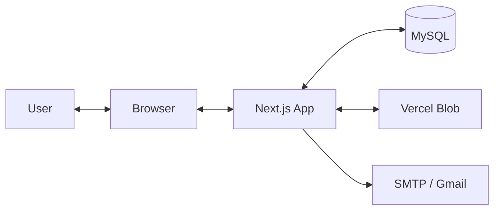
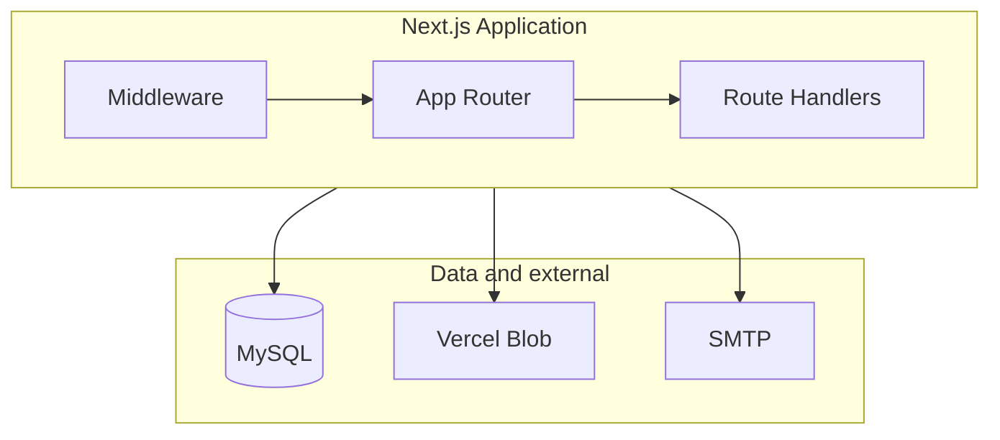
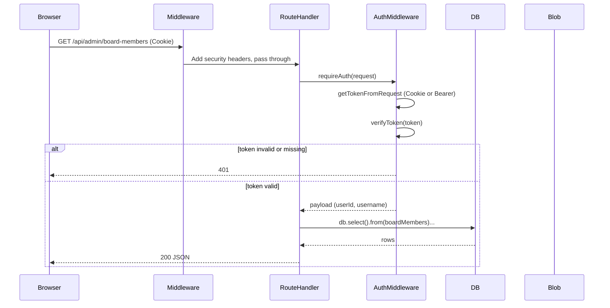

# System architecture

This document describes the high-level architecture of iSynergies Web: system context, containers, request flow, domains, design decisions, and performance considerations.

---

## Table of contents

1. [System context diagram](#system-context-diagram)
2. [Container diagram](#container-diagram)
3. [Request lifecycle (sequence)](#request-lifecycle-sequence)
4. [Major domains and modules](#major-domains-and-modules)
5. [Key design decisions and tradeoffs](#key-design-decisions-and-tradeoffs)
6. [Performance considerations](#performance-considerations)

---

## System context diagram

- **User** interacts with the **Browser**.
- **Browser** talks to the **Next.js App** (pages + API routes).
- **Next.js App** uses **MySQL** for all persistent data (content, admin users, contact messages, images metadata, and optionally image data).
- **Next.js App** uses **Vercel Blob** (optional) for uploaded images/media when `BLOB_READ_WRITE_TOKEN` is set.
- **Next.js App** sends contact form emails via **SMTP** (e.g. Gmail) when email env vars are set.

---

## Container diagram

- **Next.js Application:** Single process. **Middleware** runs on the Edge and sets security headers only (no auth). **App Router** serves pages (public landing, admin dashboard, login). **Route Handlers** serve all API endpoints under `app/api/`.
- **MySQL:** Primary data store (Drizzle ORM, connection pool in `app/db/index.ts`).
- **Vercel Blob:** Optional storage for uploads; used when configured.
- **SMTP:** Optional; used for contact form emails.

---

## Request lifecycle (sequence)

Typical flow for an authenticated admin API request:

For a public request (e.g. `GET /api/images/123`):

- **Middleware** runs (headers only).
- **Route Handler** runs; no auth. Handler may read from **DB** and/or redirect to **Blob** URL.

For login:

- **Route Handler** checks rate limit, then validates credentials against **DB**, creates JWT, sets `admin_token` cookie, returns JSON.

---

## Major domains and modules

| Domain | Location | Responsibility |
|--------|----------|----------------|
| **Public site** | `app/page.tsx`, `app/components/*` | Landing page sections (Hero, About Us, Services, Projects, Shop, Team, Contact, etc.). Fetches content from public or admin GET endpoints. |
| **Admin dashboard** | `app/admin/dashboard/**` | CMS UI; layout wraps with AuthProvider; pages call admin API with cookie/Bearer. |
| **Admin login** | `app/admin/login/page.tsx` | Login form; POST to `/api/admin/auth/login`. |
| **API (public)** | `app/api/contact/`, `app/api/images/`, `app/api/media/`, `app/api/users/` | Contact form, image/media serve, disabled users endpoint. |
| **API (admin)** | `app/api/admin/**` | All CMS CRUD, uploads, auth (login/logout/me); all protected by `requireAuth()` or `requireUser()` except login. |
| **Auth** | `app/lib/auth.ts`, `app/lib/auth-middleware.ts`, `app/lib/auth-context.tsx` | JWT create/verify, password hash/verify, getTokenFromRequest; requireAuth/requireUser; client AuthProvider, /me polling, session-expired modal. |
| **DB** | `app/db/index.ts`, `app/db/schema.ts` | Connection pool, withRetry, Drizzle schema. |
| **Upload** | `app/api/admin/upload/`, `upload-chunk/`, `upload-finalize/`, `upload-blob/`, `app/lib/blob-token.ts` | DB-stored images (single or chunked) and Vercel Blob uploads. |
| **Security / rate limit** | `middleware.ts`, `app/lib/rate-limit.ts`, `app/lib/sanitize.ts` | Security headers; in-memory rate limit (login, contact); HTML sanitization for CMS content. |

---

## Key design decisions and tradeoffs

| Decision | Rationale | Tradeoff |
|----------|-----------|----------|
| **Single Next.js app (no separate API server)** | One codebase, one deploy; Route Handlers colocated with app. | API and frontend share the same process and scaling; no independent API scaling. |
| **Per-route auth (no global auth middleware)** | Auth is required only for admin routes; public routes stay simple. Middleware does not have DB access (Edge). | Every admin route must call `requireAuth(request)`; forgetting it would expose the endpoint. |
| **JWT in httpOnly cookie + optional Bearer** | Cookie works with same-origin requests; Bearer allows non-browser clients. Cookie is primary for browser. | Client also stores token in localStorage for AuthContext; XSS could read it (cookie remains primary for API). |
| **In-memory rate limiting** | Simple; no Redis dependency. | In serverless (e.g. Vercel), each instance has its own limit; for strict global limits use Redis or platform rate limiting. |
| **CMS content sanitized before render** | All `dangerouslySetInnerHTML` input is passed through `sanitizeHtml()` (DOMPurify allowlist) to prevent stored XSS. | Some HTML may be stripped if not in the allowlist; rich formatting is limited to allowed tags. |
| **No foreign keys in DB schema** | Schema stays flexible; relationships enforced in application code. | Referential integrity (e.g. team_members.group_id) is not enforced by DB; bugs could leave orphaned refs. |
| **Board/hero/shop content GETs public** | Landing page needs to fetch content without auth; admin GETs for these resources do not require auth. | Anyone can read that content via API; no sensitive data. |

---

## Performance considerations

| Area | Implementation | Notes |
|------|----------------|--------|
| **DB connections** | Pool in `app/db/index.ts`; `connectionLimit` 5 (dev) / 1 (prod), `queueLimit` 10/3. | Prod uses 1 to avoid exhausting serverless DB limits; adjust per provider. |
| **Image serving** | If `images.url` or `media.url` is a Blob URL, handler redirects (302/307) instead of streaming from DB. | Reduces app memory and CPU; Blob serves the binary. |
| **Chunked images** | Large uploads stored in `image_chunks`; reassembly in `app/api/images/[id]/route.ts` for range requests (video). | Reassembly is done on demand; avoid storing very large files in DB when Blob is available. |
| **Rate limiting** | In-memory; keyed by IP (X-Forwarded-For / X-Real-IP). | Per-instance in serverless; acceptable for moderate traffic. |
| **Auth** | JWT stateless; no DB lookup per request after verify. | Fast; token expiry (7d) is the only revocation mechanism unless JWT_SECRET is rotated. |
| **Hot paths** | Public image/media GET, admin list GETs (board-members, projects, etc.). | No caching layer in app; rely on CDN/Blob for static assets and image redirects. |
