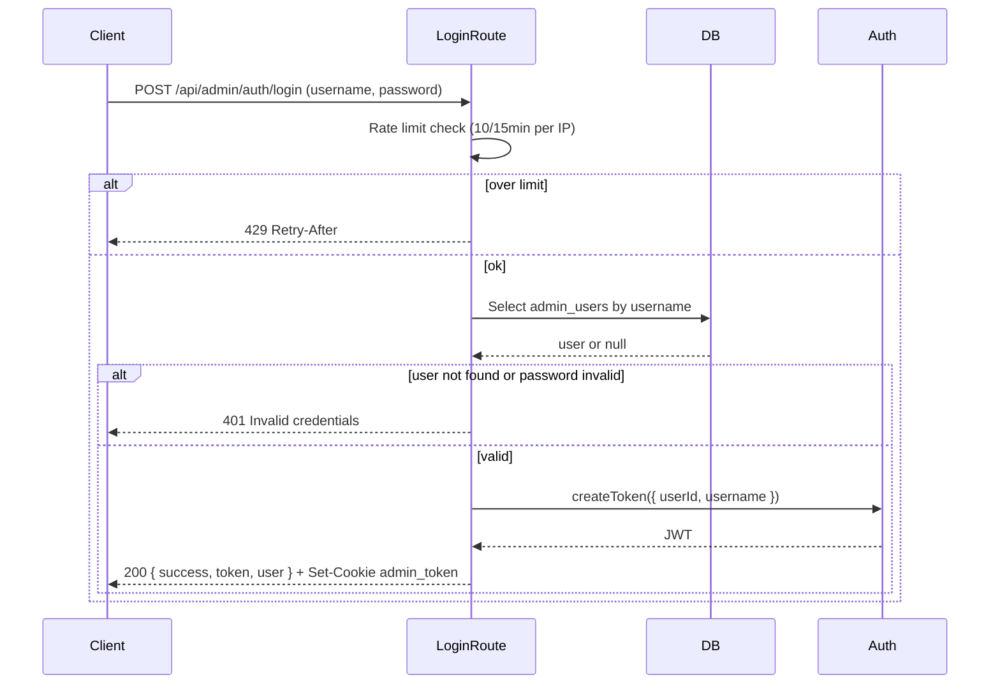
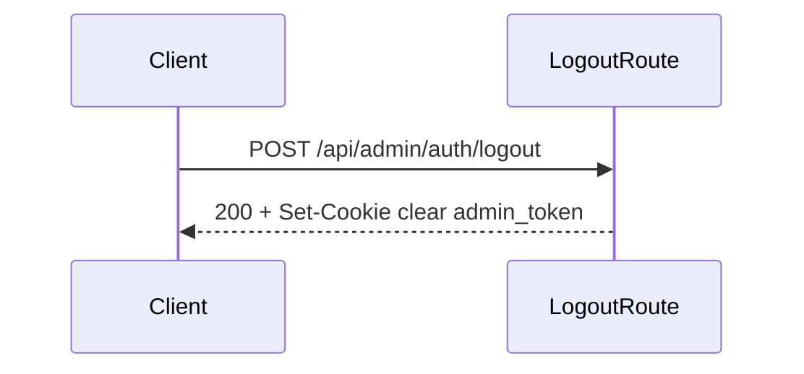
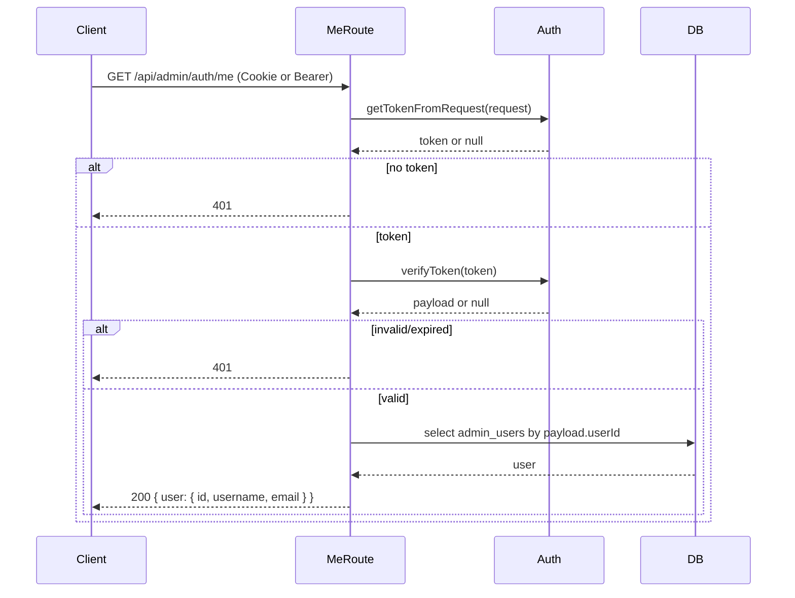

# Authorization and authentication

This document describes how authentication and authorization work: auth flows, token/session storage, role model, guards, and common failure cases.

---

## Table of contents

1. [Auth flows](#auth-flows)
2. [Token and session storage](#token-and-session-storage)
3. [Role model and permission checks](#role-model-and-permission-checks)
4. [Middleware and guards](#middleware-and-guards)
5. [Common auth failures and resolution](#common-auth-failures-and-resolution)
6. [Security pitfalls](#security-pitfalls)

---

## Auth flows

### Login

- **Rate limit:** 10 attempts per IP per 15 minutes; 429 with `Retry-After` when exceeded.
- **Message:** Generic "Invalid credentials" for both user-not-found and wrong password (no enumeration).
- **Cookie:** `admin_token=<jwt>`; httpOnly, Secure in production, SameSite=Strict, path=/, maxAge 7 days.

### Logout

- Server clears the `admin_token` cookie. No server-side session store; JWT is stateless, so "logout" is cookie removal only.

### Current user (/me)

- Used by the dashboard to confirm session and display user. Client calls `/me` on load and on retry after transient errors.

### Refresh

- **There is no refresh endpoint.** JWT expiry is 7 days; when it expires, the user must log in again. Client shows a "Session expired" modal (see [FRONTEND_GUIDE.md](FRONTEND_GUIDE.md)) and redirects to login on confirm.

---

## Token and session storage

| Location | Purpose | Security note |
|----------|---------|----------------|
| **Cookie `admin_token`** | Primary; sent automatically on same-origin API requests. | httpOnly (not readable by JS), Secure in production, SameSite=Strict. Primary auth for API. |
| **localStorage** | Client stores token for AuthContext (e.g. status, user). | Readable by JS; if XSS occurs, token can be stolen. Cookie remains primary for server; consider removing localStorage copy for stronger XSS mitigation. |

Token is obtained from the request in this order (see `app/lib/auth.ts`):

1. `Authorization: Bearer <token>`
2. Cookie `admin_token=<token>`

---

## Role model and permission checks

- **Single admin role.** There is no roles or permissions table. Any valid admin JWT can access all admin API routes.
- **requireAuth(request):** Returns 401 response or the payload `{ userId, username }`. Used by almost all admin routes.
- **requireUser(request):** Same as requireAuth but returns the payload (throws if 401); used where `userId` is needed (e.g. media, videos) for ownership. No per-resource permission checks; any admin can access any admin resource.

---

## Middleware and guards

| Layer | File | What it does |
|-------|------|--------------|
| **Edge middleware** | `middleware.ts` | Sets security headers only (X-Frame-Options, CSP, etc.). Does **not** perform auth. |
| **Server auth guard** | `app/lib/auth-middleware.ts` | `requireAuth(request)` and `requireUser(request)`. Each admin route calls one of these first; no global API middleware. |
| **Client guard** | `app/admin/dashboard/layout.tsx` + `app/lib/auth-context.tsx` | `AuthProvider` wraps dashboard; layout redirects to `/admin/login` when status is `unauthenticated`. Session-expired modal on 401/403. |

**Enforcement:** Auth is enforced **only** on the server. Client-side redirect is UX; all sensitive operations must be protected by `requireAuth()` / `requireUser()` in the route.

---

## Common auth failures and resolution

| Symptom | Cause | Resolution |
|---------|--------|------------|
| 401 "Authentication required" | No cookie and no Bearer header, or cookie not sent (e.g. cross-origin). | Ensure same-origin requests or send `Authorization: Bearer <token>`. For dashboard, use same origin and credentials (cookies) included. |
| 401 "Invalid or expired token" | Token missing, malformed, or signature/expiry invalid. | Re-login. If persistent, check JWT_SECRET is same across restarts and not changed. |
| 429 on login | Rate limit (10/15min per IP). | Wait for window to reset or use different IP; response includes `Retry-After`. |
| Session works then 401 after a while | Token expired (7d). | Re-login; consider shorter expiry if needed. |
| 401 after deploy | New deployment may have new JWT_SECRET if env was changed. | Ensure JWT_SECRET is unchanged or all users re-login. |
| Dashboard shows "Checking admin session…" forever | /me failing (network, 5xx, or CORS). | Check network tab for /me request; fix server or CORS. Auth context retries on 5xx with backoff. |

---

## Security pitfalls

- **XSS and token theft:** Token is also in localStorage for AuthContext. XSS could read it. Mitigations: CSP and sanitization (see [SECURITY.md](SECURITY.md)); prefer not storing token in localStorage if possible (cookie-only + /me for user info).
- **CSRF:** Cookie is SameSite=Strict, so same-site requests only. No CSRF token used; GET requests are not mutating. Admin mutations are POST/PUT/DELETE with cookie; SameSite reduces CSRF from other sites.
- **No refresh:** Expired JWT requires re-login; no refresh token. Acceptable for single-admin CMS; for longer sessions without re-login, consider refresh flow.
- **Forgetting requireAuth:** Any new admin route must call `requireAuth(request)` (or `requireUser(request)`) first; otherwise the route is exposed. Code review should verify this.
